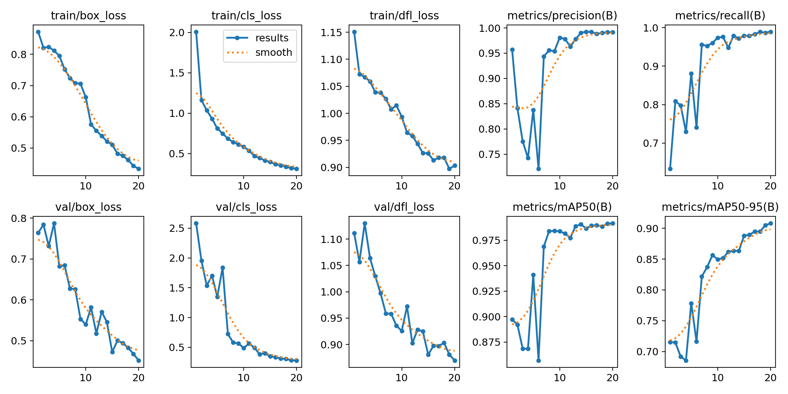

# Dispatch Monitoring System

An AI-powered monitoring system for commercial kitchen dispatch areas using computer vision to detect and classify dishes and trays with continuous model improvement through user feedback.

## Overview

The system provides real-time monitoring of kitchen dispatch areas through:
- Object detection using YOLOv8 to identify dishes and trays
- State classification using EfficientNet-B1 to categorize objects as empty, kakigori, or not_empty
- User feedback collection for continuous model improvement
- Web-based interface for monitoring and feedback

## Core Technologies

- **Detection**: YOLOv8 for object detection
- **Classification**: EfficientNet-B1 for state classification  
- **Interface**: Streamlit web application
- **Deployment**: Docker Compose
- **Processing**: OpenCV for image processing

## System Architecture

### Directory Structure
```
dispatch-monitoring-system/
├── inference/               # Main application logic
│   ├── inference.py        # Detection + classification pipeline
│   ├── retrain.py          # Feedback processing and retraining
│   └── streamlit.py        # Web interface
├── training/               # Model training scripts
│   ├── classification/     # EfficientNet-B1 training
│   └── detection/          # YOLOv8 training
├── models/                 # Model weights storage
├── data/                   # Processed training data
├── feedback/               # User feedback for retraining
├── test/                   # Test assets and validation
└── setup/                  # Model download utilities
```

### Processing Pipeline
```
Input Image/Video
       ↓
1. Preprocessing & Enhancement
       ↓
2. Object Detection (YOLOv8)
   - Sliding window for large images
   - Multi-scale detection
       ↓
3. State Classification (EfficientNet-B1)
   - Crop detected objects
   - Classify each object's state
       ↓
4. Post-processing & Annotation
       ↓
Output Results + Feedback Collection
```

## Installation & Deployment

### Docker Compose (Recommended)

1. **Clone repository**:
```bash
git clone https://github.com/anhngtrminh/dispatch-monitoring-system.git
cd dispatch-monitoring-system
```

2. **Deploy with Docker Compose**:
```bash
docker-compose up --build
```

3. **Access application**: Navigate to `http://localhost:8501`

### Using the Dockerfile Directly

If you prefer to use the Dockerfile directly without Docker Compose:

1. **Build the Docker image**:
```bash
# Build the image with a custom tag
docker build -t dispatch-monitoring-system .
```

2. **Run the container**:
```bash
# Basic run command
docker run -p 8501:8501 dispatch-monitoring-system

# Or with volume mounting for persistent feedback storage
docker run -p 8501:8501 -v $(pwd)/feedback:/app/feedback dispatch-monitoring-system

# Run in detached mode (background)
docker run -d -p 8501:8501 --name dispatch-monitor dispatch-monitoring-system
```

#### Dockerfile Explanation

The Dockerfile performs the following steps:

- **Base Image**: Uses `python:3.10-slim` for a lightweight Python environment
- **System Dependencies**: Installs `ffmpeg` and `libgl1-mesa-glx` required for OpenCV
- **Working Directory**: Sets `/app` as the container's working directory
- **Copy Files**: Copies all project files into the container
- **Python Dependencies**: Installs packages from `requirements.txt`
- **Model Download**: Attempts to download pre-trained models (gracefully handles failures)
- **Port Exposure**: Exposes port 8501 for Streamlit
- **Startup Command**: Launches the Streamlit application with CORS disabled

#### Advanced Docker Usage

**With GPU support** (if you have NVIDIA GPU and nvidia-docker):
```bash
# Build with GPU support
docker build -t dispatch-monitoring-system:gpu .

# Run with GPU access
docker run --gpus all -p 8501:8501 dispatch-monitoring-system:gpu
```

### Manual Installation

1. **Environment setup**:
```bash
conda create -n dispatch python=3.10
conda activate dispatch
pip install -r requirements.txt
```

2. **Download models**:
```bash
python setup/download_models.py
```

3. **Run application**:
```bash
streamlit run inference/streamlit.py
```

## Usage

### Web Interface Operations

1. **Image Upload**: Support for PNG, JPG, JPEG, BMP, TIFF, WebP formats
2. **Detection Configuration**:
   - Confidence threshold: 0.1-0.9 (higher = fewer, more confident detections)
   - Sliding window: Enable for large image processing
   - Image enhancement: Auto/Always/Never/Upscale_only
3. **Result Review**: Examine detections with bounding boxes and classifications
4. **Feedback Submission**: Correct misclassifications to improve model performance

### Command Line Interface

```bash
# Process single image
python inference.py -i test/image.jpg

# Process multiple images with custom confidence
python inference.py -i "test/*.jpg" --conf 0.3

# Process video with frame skipping
python inference.py -i video.mp4 --skip-frames 30

# High-resolution processing
python inference.py -i large_image.jpg --enhance always
```

## Model Training

### Data Requirements

**Classification Data Structure**:
```
AU/Dataset/Classification/
├── tray/
│   ├── empty/
│   ├── kakigori/
│   └── not_empty/
└── dish/
    ├── empty/
    ├── kakigori/
    └── not_empty/
```

**Detection Data Structure**:
```
training/detection/
├── dataset.yaml           # YOLO configuration
├── images/
│   ├── train/
│   └── val/
└── labels/               # YOLO format annotations
    ├── train/
    └── val/
```

### Training Process

#### 1. Classification Training
```bash
python training/classification/train.py --classifier both --epochs 10
```

**Configuration**:
- Base model: EfficientNet-B1
- Input size: 224×224
- Classes: empty, kakigori, not_empty
- Automatic 80/20 train/validation split

#### 2. Detection Training
```bash
python training/detection/train.py --config training/detection/dataset.yaml --epochs 20
```

**Configuration**:
- Base model: YOLOv8 nano/small
- Input size: 640×640
- Classes: dish, tray
- Early stopping enabled

### Model Performance

#### Detection Model

**Final Epoch:** `20`  
**Best Validation mAP@0.5:** `0.99177`  
**Best Validation mAP@0.5:0.95:** `0.90814`  
**Final Validation Losses:**  
- Box Loss: `0.4332`  
- Class Loss: `0.3120`  
- DFL Loss: `0.9031`  

---

#### 🔢 Epoch Progression (Key Metrics)

| Epoch | Precision | Recall | mAP@0.5 | mAP@0.5:0.95 | Val Box Loss | Val mAP@0.5 |
|-------|-----------|--------|---------|--------------|---------------|-------------|
| 1     | 0.9572    | 0.6329 | 0.8971  | 0.7154       | 0.7640        | 0.8971      |
| 5     | 0.8375    | 0.8811 | 0.9412  | 0.7783       | 0.6824        | 0.9412      |
| 10    | 0.9809    | 0.9738 | 0.9839  | 0.8497       | 0.5398        | 0.9839      |
| 15    | 0.9925    | 0.9789 | 0.9868  | 0.8881       | 0.4723        | 0.9868      |
| 20    | 0.9913    | 0.9896 | 0.9918  | 0.9081       | 0.4520        | 0.9918      |

---

#### Classification Models
**Dish Classifier**:

**Best Validation Accuracy:** `0.9874` (**98.74%**)

```
Classification Report for TRAY:
              precision    recall  f1-score   support

       empty     1.0000    0.9865    0.9932        74
    kakigori     0.9718    1.0000    0.9857        69
   not_empty     0.9895    0.9792    0.9843        96

    accuracy                         0.9874       239
   macro avg     0.9871    0.9886    0.9877       239
weighted avg     0.9876    0.9874    0.9875       239
```

**Tray Classifier**:

**Best Validation Accuracy:** `0.9650` (**96.50%**)

```
Classification Report for DISH:
              precision    recall  f1-score   support

       empty     1.0000    0.9688    0.9841       160
    kakigori     0.9318    0.9880    0.9591        83
   not_empty     0.9400    0.9400    0.9400       100

    accuracy                         0.9650       343
   macro avg     0.9573    0.9656    0.9611       343
weighted avg     0.9660    0.9650    0.9652       343
```

### 🏁 Training Summary

```
TRAY Classifier:
  Classes: ['empty', 'kakigori', 'not_empty']
  Final Accuracy: 0.9874 (98.74%)
  Best Accuracy: 0.9874 (98.74%)

DISH Classifier:
  Classes: ['empty', 'kakigori', 'not_empty']
  Final Accuracy: 0.9650 (96.50%)
  Best Accuracy: 0.9650 (96.50%)
```

## Continuous Improvement

### Feedback Loop
1. **Collection**: Users correct misclassifications via web interface
2. **Processing**: Feedback data is validated and augmented
3. **Retraining**: Models are updated periodically with new data
4. **Monitoring**: Performance tracking shows accuracy improvements

### Data Validation
```python
# Verify classification data structure
from torchvision import datasets
dataset = datasets.ImageFolder('AU/Dataset/Classification/tray')
print(f'Classes: {dataset.classes}')
print(f'Samples: {len(dataset)}')
```

## Dataset Access

**Training Data**: 2,000+ labeled images with bounding boxes and classifications
**Validation Data**: 500+ images for model validation  
**Test Data**: 300+ images for evaluation

**Access**: [Google Drive Dataset](https://drive.google.com/drive/folders/1Ji4RVZveHcBkLngfgH0eexLIWiUp2c78?usp=drive_link)
